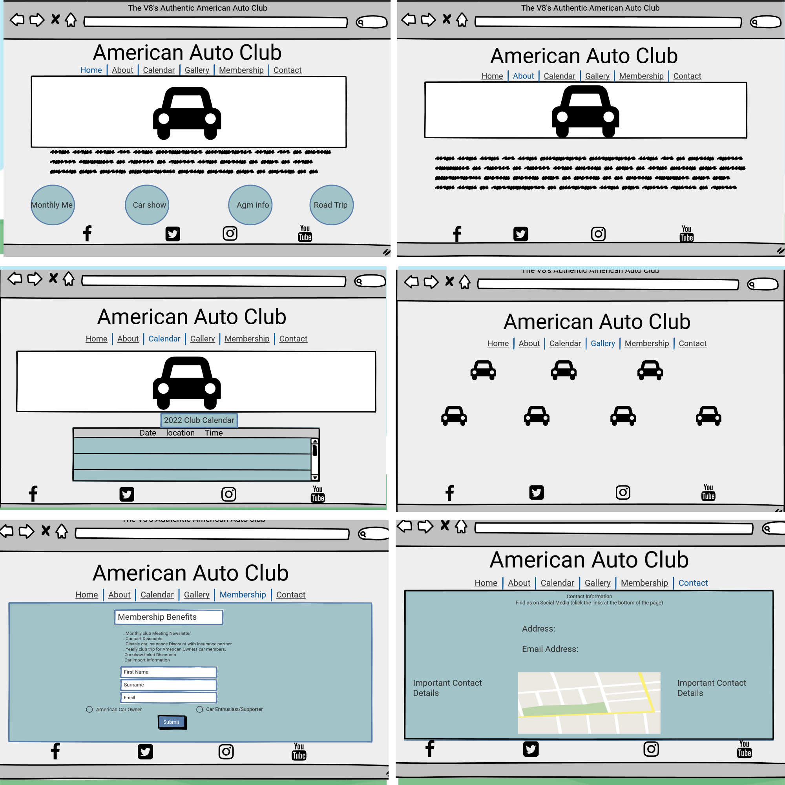
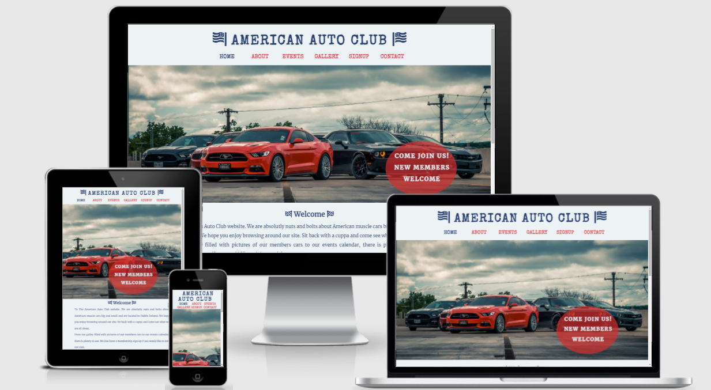

# The Authentic American Auto Club

The Authentic American Auto Club is a site that hopes to keep American car owners and American car enthusiast in Ireland a place to keep up with Information regarding the club meetings and yearly car show.

It is aimed toward new and existing members who are Interested intaking part in the club. The site will be targeted towards current American car owners and new car owners who want a club to socialize and have support from other members.

The site will also be a place where Members of the public can view photos of current members cars and calendar information for up coming car shows and meet up's to view New and classic American vehicles.

The Authentic American Auto club will be useful for member's for important contact details, up coming calendar events more importantly a place to belong.

# Ux Design Stage

 I started with designing how the site will look first. Using balasmiq wireframe, I plotted out how each page should be presented and a guide to how the individual site pages will be presented. I used this method to work out how best to list the navigational buttons. This wireframe template gave me the general pattern of how the layout site will look eventually. From this template I now can build and style my site using the wireframe as a guide, helping to keep my website design and layout as envisioned. The original name on the site for the club was The v8's Authentic american auto club. But during design phase this was shortened to The Authentic American Auto Club for aesthetics and to fit in with the overall design.

# Features

