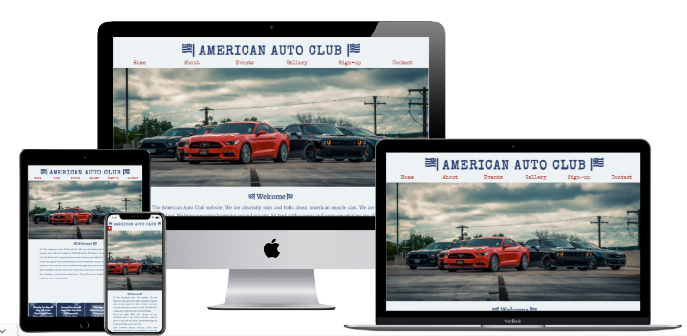
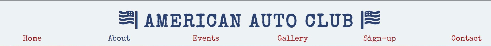
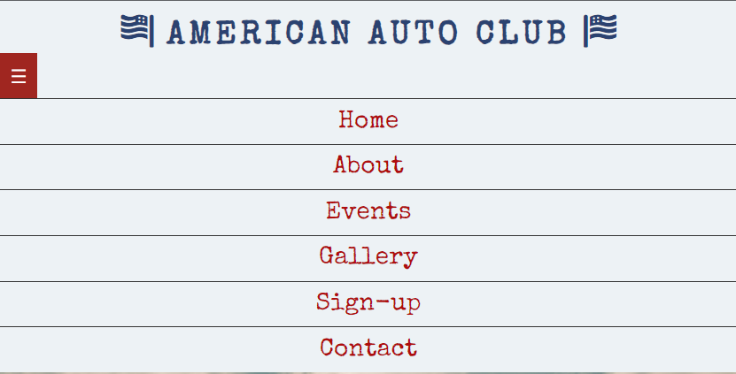

# The Authentic American Auto Club

The Authentic American Auto Club is a site that hopes to keep American car owners and American car enthusiast in Ireland a place to keep up with Information regarding the club meetings and yearly car show.

It is aimed toward new and existing members who are Interested intaking part in the club. The site will be targeted towards current American car owners and new car owners who want a club to socialize and have support from other members.

The site will also be a place where Members of the public can view photos of current members cars and calendar information for up coming car shows and meet up's to view New and classic American vehicles.

The Authentic American Auto club will be useful for member's for important contact details, up coming calendar events more importantly a place to belong.

# Ux Design Stage

 I started with designing how the site will look first. Using balasmiq wireframe, I plotted out how each page should be presented and a guide to how the individual site pages will be presented. I used this method to work out how best to list the navigational buttons. This wireframe template gave me the general pattern of how the layout site will look eventually. From this template I now can build and style my site using the wireframe as a guide, helping to keep my website design and layout as envisioned. The original name on the site for the club was The v8's Authentic american auto club. But during design phase this was shortened to The Authentic American Auto Club for aesthetics and to fit in with the overall design.

# Features

The main features of the website consists of a large Logo with the name of the club and navigational menu centered directly below it. Styled in Blue red contrasting against white background but keeping with the american flag colors. This runs across all six pages of the website

The main Image is of American cars with the center car in red. I choose this image as it fitted in with the overall colur and style of the ux design.

The footer contains social media links for the user to follow on to a seperate page. 

The second page is an club information page about how the club started and how the club gives back to the community.

On the third page its is an events page there is a styled calendar for members to follow events planned across the year for the club.

The forth page is club gallery cotaining images of club meeting and members cars that are currently part of the club.

The fifth page is membership sign up page. With a styled blue sign up form against a backround of a red Ford Mustang, keeping in with the theme of the page.

The final page, contact information is displayed on a background of blue, the same as the sign up form. This is to help information be more visable easy to see on white background. Thsi includes a google map of the general location of the club.

This website is built for new members who are interested in Joining the club, current members to keep track of club calendar for the year and members of the public who may enjoy car shows and charity events. 

My project achieves this by keeping infomation precise, easy to navigate site, bright and visable navigation bar which gives feed back to the page you are on. Eye catching background images enhance the overall experience by showning the site user what type pf club website they are viewing.

## Existing Features

- __Navigation Bar for large screen__
 
     - Featured on all six pages of the website, the full responsive navigation bar includes links to about page, events, gallery, sign-up form and contact information page.

     - This feature will allow user to navigate clearly throughout the site with ease. The navigation bar also has feed back letting the user know which page they are currently on as the colour changes from red to blue when clicked.

- __Navigation Bar for small screen__
 
 

 

