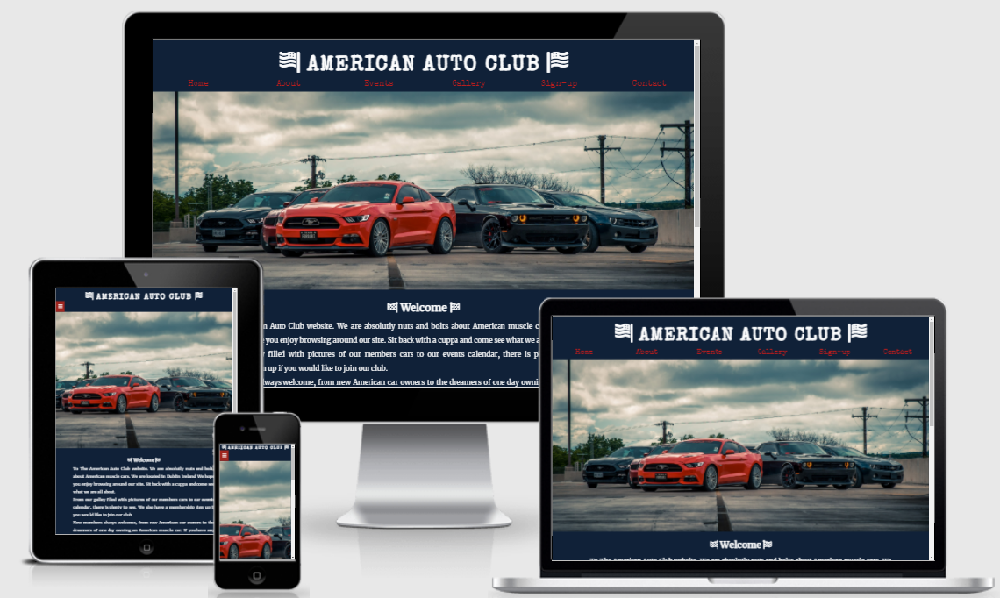

# The American Auto Club

## By Caroline Harte

## [Click here to view Site.](https://charte-dot.github.io/american-auto-club/)

## [Click here to view Repository.](https://github.com/Charte-dot/american-auto-club)

# The aim of the site

- The American Auto Club is a site that hopes to keep American car owners in Ireland and American car enthusiast a place to keep up with Information regarding the club meetings and yearly car show.

- It is aimed toward new and existing members who are Interested intaking part in the club. The site will be targeted towards current American car owners and new car owners who want a club to socialize and have support from other members.

- The site will also be a place where Members of the public can view photos of current members cars and calendar information for up coming car shows and meet up's to view New and classic American vehicles.

- The American Auto club will be useful for member's for important contact details, up coming calendar events more importantly a 

# UX Design

- I started with designing how the site will look first. Using balasmiq wireframe. I plotted out how each page should be presented and a guide to how the individual site pages will be presented. 

- I used this method to work out how best to list the navigational buttons. This wireframe template gave me the general pattern of how the layout site will look eventually. 

- From this template I now can build and style my site using the wireframe as a guide, helping to keep my website design and layout as envisioned. 

## - __Colour Scheme__

I choose the colour scheme based on what I wanted to convey visually to the user upon opening the website but also to keep in tone with the colours on the American flag.
- Background: Full navy background as navy conveys importance, confidence, power, and authority, as well as intelligence, stability and unity. Also it is one of the main colours in the American flag that encapulates all the stars that represent the American states. Purpose of this colour on the website is to evoke the sense of unity and togetherness of the club.

- Club logo/main title/main text bodies
Upon opening the site, the main logo and all text throughout the site is a brilliant white. I choose this colour to contrast against the navy and to stand out and catch the users attention. The colour white symbolises understanding, protection and promotes feelings of fresh beginnings and renewal. This is important to gain new members to the club aswell as bringing current members back.

-Main menu/Navigation

 

 

