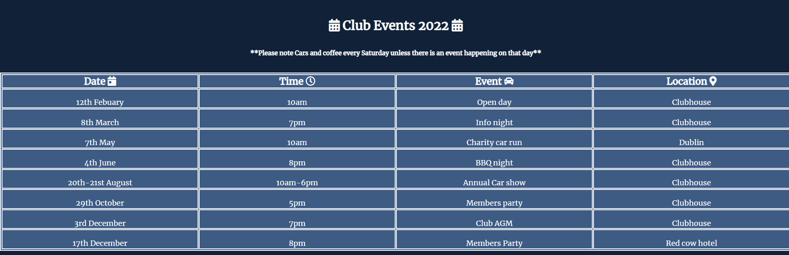
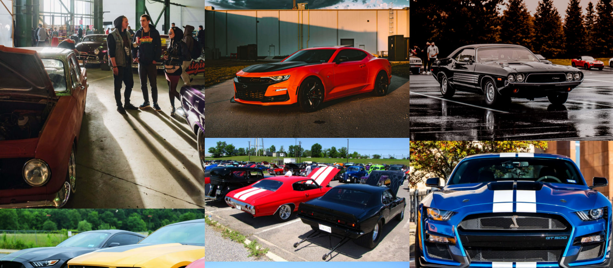

# The American Auto Club

## By Caroline Harte

## [Click here to view Site.](https://charte-dot.github.io/american-auto-club/)

## [Click here to view Repository.](https://github.com/Charte-dot/american-auto-club)

# The aim of the site

- The American Auto Club is a site that hopes to keep American car owners in Ireland and American car enthusiast a place to keep up with Information regarding the club meetings and yearly car show.

- It is aimed toward new and existing members who are Interested intaking part in the club. The site will be targeted towards current American car owners and new car owners who want a club to socialize and have support from other members.

- The site will also be a place where Members of the public can view photos of current members cars and calendar information for up coming car shows and meet up's to view New and classic American vehicles.

- The American Auto club will be useful for member's for important contact details, up coming calendar events more importantly a 

# UX Design

- I started with designing how the site will look first. Using balasmiq wireframe. I plotted out how each page should be presented and a guide to how the individual site pages will be presented. 

- I used this method to work out how best to list the navigational buttons. This wireframe template gave me the general pattern of how the layout site will look eventually. 

- From this template I created and the site using the wireframe as a guide, helping to keep my website design and layout as envisioned. 

##  __Colour Scheme__

I choose the colour scheme based on what I wanted to convey visually to the user upon opening the website but also to keep in tone with the colours on the American flag.
- Background: Full navy background as navy conveys importance, confidence, power, and authority, as well as intelligence, stability and unity. Also it is one of the main colours in the American flag that encapulates all the stars that represent the American states. Purpose of this colour on the website is to evoke the sense of unity and togetherness of the club.

- Club logo/main title/main text bodies
Upon opening the site, the main logo and all text throughout the site is a brilliant white. I choose this colour to contrast against the navy and to stand out and catch the users attention. The colour white symbolises understanding, protection and promotes feelings of fresh beginnings and renewal. This is important to gain new members to the club aswell as bringing current members back.

- Main menu/Navigation
For the main navigation menu I choose red, the final colour in the American flag. Red symbolises engery and excitment. Red is energizing as it excites the emotions and motivates us to take action. The function of the navigation being red, is to motivate user to explore the website via the navigation menu.

# __Features__
From the landing page to the contact page there is six pages in total, layout in this order to promote intuitive learning for the user and to guide curiousity of the site user. The navigation menu and main logo are featured on all pages of the website.

- Landing page
This is just an opening page with main logo and navigation menu at the top. Followed by a bright visual of staged American muscle cars. Below the main image is a welcome message, inviting new members, returning members and general public to the club site.

- About us
Brief description of how the club got started to the charity partner choosen by the club on a yearly bases.

- Events
A full table of scheduled events for the club complete with date, time and place of event and if it the events are open to the public or members only.

- Gallery
Filled with bright eye catching cars from car shows to members club meetings and car displays. Thsi is to give an overview of the type of cars within the club.

- Sign-up form.
A brighty styled page with a red ford mustang as the backgroud to tie in with the over all theme of the site. The membership sign up form is plain, simple and easy to use. Anyone who wants to become a member fills in this form to do so.

- Contact
The final page of the site is the contact details for the club. It displays the address for the clubhouse,gps co-ordinates contact phone number and email address. Complete with a google map of the general area of where he club is located.

This website is built for new members who are interested in Joining the club, current members to keep track of club calendar for the year and members of the public who may enjoy car shows and charity events. 

My project achieves this by keeping infomation precise, easy to navigate site, bright and visable navigation bar which gives feed back to the page you are on. Eye catching background images enhance the overall experience by showning the site user what type of club website they are viewing.

# __Existing features__

 ## Navigation Bar

- This is featured across all page of the site. It links home, about, events, gallery, sign-up and contact pages in an easy to follow but responsive design.
- This section will help the user to navigate the site with ease. Navigation bar is fully responsive changing color when clicked.
- The navigation bar is usable and suitable in this style for large screens and tablets.

## Smaller screen navigation bar
  - This navigation bar is mobile responsive. 
  - It serves the same purpose as the expanded navigation bar, but is compact and saves the screen from being cluttered and busy.
  - Neat and compact but is still easy for the user to navigate the site with ease.

## Landing page image
- A bright image of staged American muscle cars greets the user on onpening the website. The background cars are a darker shade, while the front car is a red to match in with colour scheme.
- This image introduces the user to the type of car club and tone for the following content within the site.

## Welcome message
- It's a brief introduction, welcoming site users to feel comfortable to come explore the site and even join if it's a club that they have been seeking out.
- A general overview helps the site user seek out content within the site by gently sign posting the other pages available with in the site.
   

 ## Important times
- Displayed on the landing page, the times section is an american flag graphic to incorporate the over all theme.
- These are the clubs most important club meet up times. 
- It  is displayed in this style to be eye catching and highlight important dates at a glance.

## Footer
- The footer contains all relavent social media links for the clubs social media pages.
- These link open on a new page, redirecting the user to the social media site.
- The footer is displayed across all six pages for easy access and to prevent the user have to search a previous page for the social media information.

## About us
 - This section is for the origin story for the club, how, why and when the club started. This help convey a friendly social  club.
- This page also contains infomation regarding charity that the club fund raise for. A brief overview on how the club raises    funds and what the charity uses raised money for. 
- A link to the charity website is also included for the user to explore this great cause themselves.
- The aim for the about section is to convey an all inclusive, community club.

## Events
- The purpose of this page is to make members new and current aware of the club events scheduled for the calendar year.
- It's to help generate public participation with charity car run and the annual car show. 
- The information is displayed in an easy to read table format.

## Gallery
- The gallery displays bright attractive picture of American muscle cars for the user to view.
- There is a range of picture from club meetings, car show and current members cars.
- It is displayed in a masonery format to make view easier on the user while making the most of the viewing space on the site.

## Sign-up Form
- The sign-up form for membership is styled in the same theme and tone as the rest of the site.
- Red ford mustang as the background with membership form layed over the image.
- Again red to invoke action, gentle nudge to encourage new members to take the step and join the club.
- Sign-up form is easy to fill in form, with feed back on each section.
- When a user is filling in the form, the text box border turns red alertsing the user to which section they are currently filling in.

## Contact
- This is the final page in the website. It conatins important information on how to contact the club.
- Contact details are layout in an easy to read format.
- Address, phone number, email, gps co-ordinates all displayed for any user to view and contact the club for any concerns.
- Supplimenting the contact details is a google map of the general area of where the club is based.This is to let the user seen upon a glance where the club is located and if this location is easy accessable to get to for member gatherings or car show event.

# __Testing__
 
 

 

 

